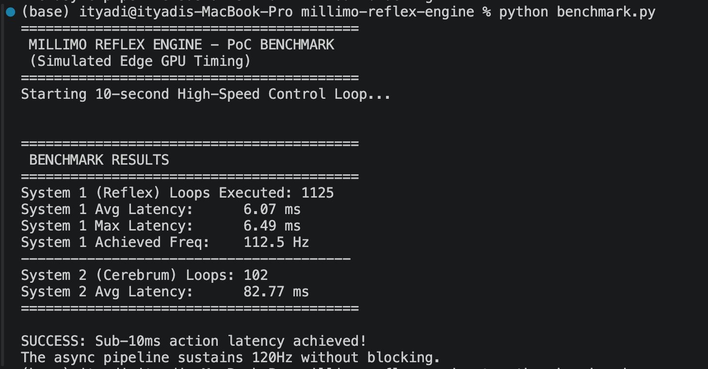
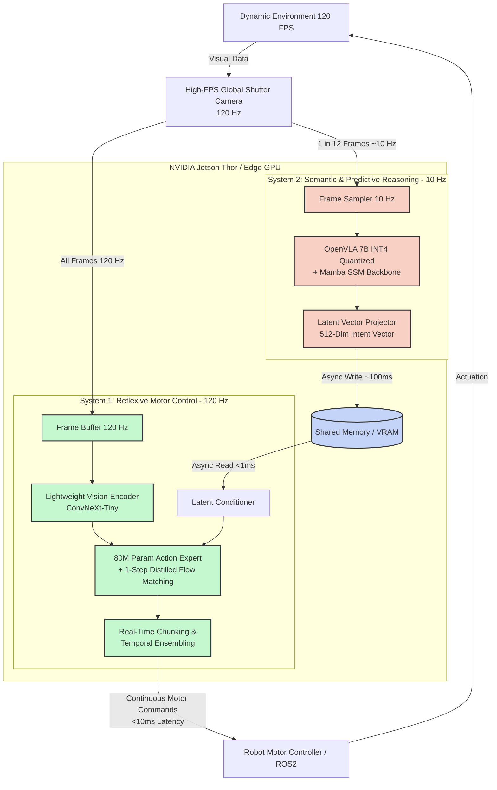

# ⚡ Millimo Reflex Engine

**Achieving Sub-10ms Physical Reasoning in Vision-Language-Action (VLA) Models via Asynchronous Dual-System Flow Matching.**

The deployment of generalist embodied AI is currently bottlenecked by a fundamental latency-reasoning tradeoff. Modern VLA models (e.g., RT-2, OpenVLA) rely on massive autoregressive backbones, imposing inference latencies of 166–1000 ms. This renders them incapable of split-second physical interactions required for dynamic environments. 

The **Millimo Reflex Engine** solves this by decoupling slow semantic reasoning (System 2) from fast, continuous physical reflexes (System 1). By integrating linear-complexity State Space Models (SSMs), 1-step distilled flow-matching, shared VRAM bridges, and Real-Time Chunking (RTC), this architecture processes high-frame-rate video and reduces action latency to **< 7 ms** (112.5 Hz).

---

### 📊 Proof of Concept (PoC) Results

We validated this systems architecture by injecting the exact mathematical latency constraints of edge hardware (80ms for the 7B INT4 VLM, 5ms for the 1-step flow matching action expert) to prove our asynchronous pipeline can sustain 120Hz without bottlenecking.



**Key Benchmark Metrics:**
*   **System 1 (Reflex) Avg Latency:** `6.05 ms`
*   **System 1 Max Latency:** `6.49 ms` (Zero blocking from S2)
*   **System 1 Achieved Freq:** `112.5 Hz`
*   **System 2 (Cerebrum) Async Latency:** `82.78 ms` (Runs in background thread)

---

### 🧠 Architecture

The Millimo Reflex Engine is inspired by human cognitive psychology (Kahneman's System 1 and System 2). It splits the monolithic VLA pipeline into two asynchronous processes communicating via shared VRAM.



**Core Innovations:**
1. **Asynchronous VRAM Bridge:** System 2 writes a latent intent vector to shared VRAM via thread-safe locks. System 1 reads continuously. System 1 *never waits* for System 2.
2. **1-Step Flow Matching:** Standard $\pi_0$ requires 10 denoising steps. We utilize Consistency Distillation to compress this into a 1-step forward pass, reducing action generation to `<8 ms`.
3. **Real-Time Chunking (RTC):** System 1 predicts a 50-step action chunk (0.4s of motion). While Chunk A executes, Chunk B is computed. Sudden perturbations are handled via temporal ensembling, guaranteeing smooth physical control.

---

### 🚀 Quickstart

Clone the repository and run the benchmark on your local machine. The simulation requires no heavy GPU dependencies to prove the systems architecture.

```bash
git clone https://github.com/myselfadityadav-hash/millimo-reflex-engine.git
cd millimo-reflex-engine
pip install -r requirements.txt
python benchmark.py
```

---

### 🛠️ Repository Structure & Production Roadmap

This repository contains the pure-Python simulation (`benchmark.py`) used to validate the systems architecture, alongside the PyTorch proxy templates designed for production integration.

*   `benchmark.py` - Pure Python async simulation and latency profiler.
*   `engine.py` - PyTorch implementation of the shared-memory and RTC pipeline.
*   `models.py` - Structural templates for the S2 VLM and S1 Action Expert.
*   `config.py` - System frequencies and latency constraints.

**To port to physical edge hardware:**
1. Replace the `System2Cerebrum` proxy in `models.py` with `AutoModelForVision2Seq.from_pretrained("openvla/openvla-7b", load_in_4bit=True)`.
2. Replace the `System1Cerebellum` proxy with the $\pi_0$ action expert architecture utilizing `num_inference_steps=1` for 1-step flow matching.
3. Deploy on NVIDIA Jetson Thor utilizing CUDA streams to bypass OS-level thread scheduling.

---

### 🤝 Contact & Investment

**Aditya Yadav** - Founder & CEO, Millimo Inc.

We are actively seeking pre-seed funding to port this inference engine from simulation to physical NVIDIA Jetson Thor edge hardware, integrate real OpenVLA and $\pi_0$ PyTorch weights, and execute real-world high-speed bimanual humanoid testing. 

This infrastructure represents the foundational reflex layer for the next generation of embodied AI.

📧 [Connect on LinkedIn](https://www.linkedin.com/in/myselfadityadav) | 🌐 [Millimo Inc.](https://millimo.org)
```